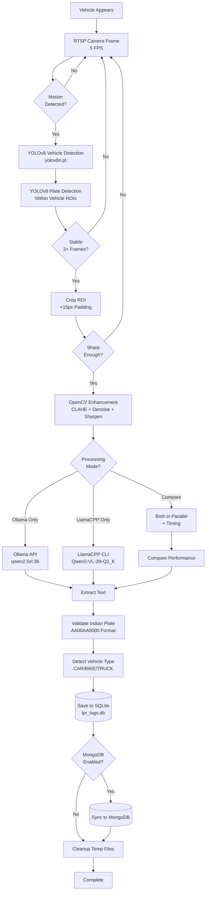

# Complete ALPR Processing Flow

## Visual Flow Diagram

## System Architecture Diagram

## 15-Stage Processing Pipeline

### Stage 1-3: Input & Trigger
| Stage | Component | Details |
|-------|-----------|---------|
| 1 | Vehicle Appears | Physical event in camera FOV |
| 2 | RTSP Frame | VIGI C320I @ 5 FPS, 1920x1080 |
| 3 | Motion Detection | Frame diff in ROI, threshold=15 |

### Stage 4-6: Detection
| Stage | Component | Details |
|-------|-----------|---------|
| 4 | Vehicle Detection | YOLOv8n, conf=0.4, CPU-optimized |
| 5 | Plate Detection | Custom model on vehicle ROIs |
| 6 | Stability Check | 3 frames, variance < 15px, 30s cooldown |

### Stage 7-9: Preprocessing
| Stage | Component | Details |
|-------|-----------|---------|
| 7 | Crop ROI | Extract plate + 15px padding |
| 8 | Sharpness Filter | Laplacian var > 100 |
| 9 | Enhancement | CLAHE → Denoise → Sharpen → Threshold |

### Stage 10-12: OCR Processing
| Stage | Component | Details |
|-------|-----------|---------|
| 10 | Mode Selection | Ollama / LlamaCPP / Compare |
| 11 | Text Extraction | Prompt-based OCR |
| 12 | Performance Compare | Timing + winner selection |

### Stage 13-15: Validation & Storage
| Stage | Component | Details |
|-------|-----------|---------|
| 13 | Plate Validation | Indian format check |
| 14 | Vehicle Type | Pattern-based classification |
| 15 | Storage | SQLite → MongoDB → Cleanup |

## Implementation Status

### ✅ Completed
- Two-stage YOLO detection (Vehicle → Plate)
- OpenCV enhancement pipeline
- Stability tracking
- SQLite storage
- Dummy camera fallback

### 🚧 In Progress
- Motion detection integration
- LlamaCPP engine
- Comparison mode
- MongoDB sync
- Enhanced validation

### 📋 Planned
- Performance benchmarking
- Configuration UI
- Real-time metrics dashboard

## Configuration Matrix

| Setting | Purpose | Default | Range |
|---------|---------|---------|-------|
| `MOTION_THRESHOLD` | Motion sensitivity | 15 | 1-50 |
| `SHARPNESS_THRESHOLD` | Blur rejection | 100 | 50-200 |
| `PLATE_ROI_X` | Detection X offset | 300 | 0-width |
| `PLATE_ROI_Y` | Detection Y offset | 600 | 0-height |
| `PLATE_ROI_W` | Detection width | 800 | 100-width |
| `PLATE_ROI_H` | Detection height | 300 | 100-height |
| `USE_LLAMA_CPP` | Enable LlamaCPP | false | bool |
| `COMPARE_ENGINES` | Benchmark mode | false | bool |
| `MONGODB_URI` | Cloud sync | - | connection string |

## Performance Targets

| Metric | Target | Current |
|--------|--------|---------|
| Vehicle Detection | < 150ms | ~100ms |
| Plate Detection | < 50ms | ~40ms |
| Enhancement | < 20ms | ~15ms |
| OCR (Ollama) | < 3s | ~2.5s |
| OCR (LlamaCPP) | < 2s | TBD |
| Total Pipeline | < 4s | ~3s |
| FPS (Display) | 10 | 10 |
| FPS (Processing) | 3-5 | 3-4 |
