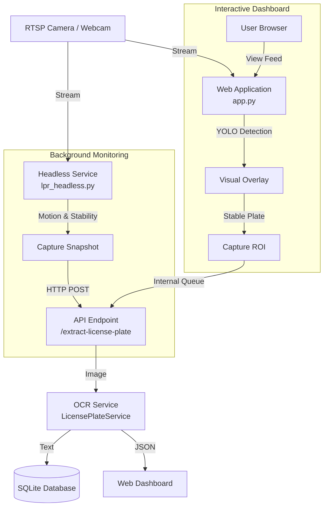

# ALPR System Flow & Architecture

This document outlines the operational flow of your License Plate Recognition (ALPR) system.

## High-Level Architecture

The system consists of two main components running in parallel to ensure both continuous monitoring and interactive usage.

## Detailed Data Flow

### 1. Continuous Monitoring (Background)
The **Headless Service** (`lpr_headless.py`) starts automatically with the app and runs in the background.
1.  **Input**: Connects to the configured RTSP stream (or webcam/dummy fallback).
2.  **Motion Detection**: Monitors for pixel changes to detect vehicle presence.
3.  **Stability Check**: Once motion is detected, it waits for the image to stabilize (approx. 3 frames) to ensure a clear capture.
4.  **Capture**: Takes a high-quality snapshot of the vehicle.
5.  **Processing**: Sends the snapshot to the local API (`http://localhost:8000/extract-license-plate`).

### 2. Live View & Interaction (Foreground)
The **Web Application** (`app.py`) serves the dashboard and API.
1.  **Video Feed**: When you view the dashboard, it pulls frames from the camera.
2.  **Real-time Detection**: Uses **YOLOv8** to detect license plates in real-time (shown as green boxes).
3.  **Stability Logic**: Tracks the plate's movement. If a plate is stationary/stable for a few frames, it automatically captures a Region of Interest (ROI).
4.  **Async Processing**: The captured ROI is queued and processed asynchronously to avoid freezing the video feed.

### 3. Recognition & Storage (Core Logic)
Both the Headless Service and the Web App send images to the same **API Endpoint**.
1.  **API Endpoint**: `/extract-license-plate` receives the image.
2.  **YOLO Refinement**: Re-runs YOLO on the uploaded image to precisely locate the plate.
3.  **OCR Extraction**: Passes the plate image to the `LicensePlateService` (using OCR tools like PaddleOCR or similar) to read the text.
4.  **Validation**: Cleans the text (removes special characters) and validates the format.
5.  **Storage**:
    *   Saves the vehicle image to `vehicle_images/`.
    *   Logs the detection (Plate Number, Timestamp, Confidence) to the `lpr_logs.db` SQLite database.
6.  **Response**: Returns the detected plate number to the caller.

## Key Features
*   **Redundancy**: The system works even if the browser is closed (thanks to the Headless Service).
*   **Fallback**: If the Camera fails, it switches to a "Dummy Camera" to keep the system alive.
*   **Deduplication**: The system uses image hashing to prevent logging the same vehicle multiple times within a short period.
